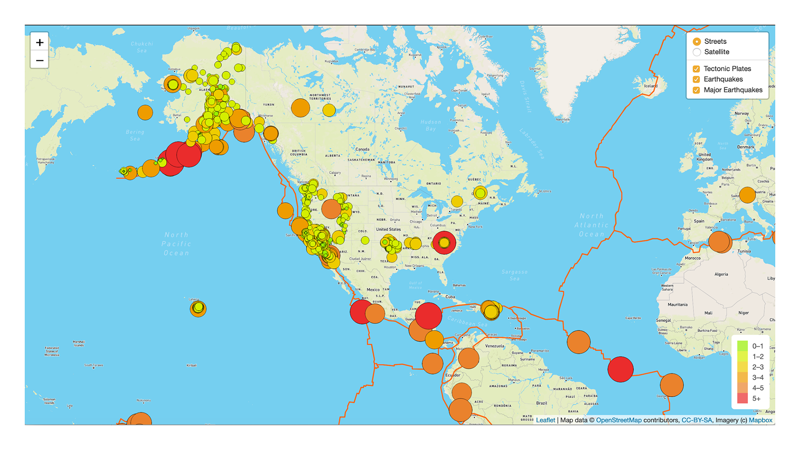
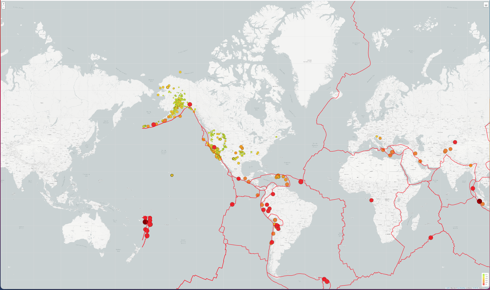
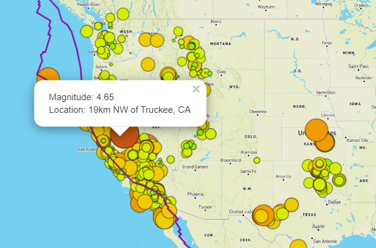

# Mapping_Earthquakes
- This project uses data provided by U.S.Geological Survey for visual repersentation of earthquakes over the last 7 days. 

## Data Citation
- The Earthquake data is from [earthquake.usgs.gov](https://earthquake.usgs.gov/).
- Map API calls are processed from [Mapbox](https://www.mapbox.com/).

## Overview
- The goal was to create an interactive map showing data from the past 7 days. 

## Results (Map Views)
- ### Streets View

- ### Satellite View

- ### Streets Major Earthquakes View

- ### Dark View

- ### Light View

- ### Earthquake Data(Magnitude of 4.65)

